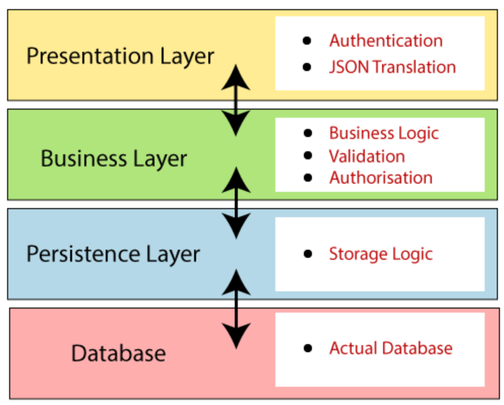

### :smile: 순환 참조

#### :book: 순환 참조란?
* Bean A도 Bean B를 참조하고, Bean B도 Bean A를 참조하는 경우에 발생
* Bean B가 생성되지 않았는데 Bean A가 Bean B를 참조해 버리면 문제 발생
* 따라서 순환 참조가 발생하면 스프링은 Bean A, B 둘중 어느 것을 먼저 생성해야 하는지 결정하지 못하고, 결국 오류를 발생시킨다.

#### :book: 순환 참조 해결 방법
* @Lazy 어노테이션 사용
  ```java
  @Component
  public class A {
      private final B b;

      @Autowired
      public A(@Lazy B b) {
          this.b = b;
      }
  }
  ```
  ```java
  @Component
  public class B {
      private final A a;

      @Autowired
      public B(A a) {
          this.a = a;
      }
  }
  ```
  * @Lazy 방식은 Bean A의 초기화 시점에 Proxy Bean B를 주입하여 초기화를 미루고, 실제로 Bean A가 사용될 때 Bean B를 주입하는 방식이다.
  * 스프링에서 권장하지 않는 방식이다.

* Setter 주입, Field 주입
  * 순환 참조를 회피할 수 있다. 그러나 요즘에는 생성자 주입을 권장하므로, 잘 안쓰이는 방법이다.
  * 생성자 주입은 순환 참조가 일어났을 경우 에러를 발생시키면서 Spring이 구동되지 않기 때문에 순환 참조에 대한 예방이 가능하다.

* 순환 참조 에러 해결 방법이 여러개 있지만, 순환 참조가 안 일어나도록 설계하는 것이 좋은 디자인이다.
# DAO (Data Access Object)

> 실제로 DB에 접근하는 객체

- DB의 Data를 CRUD하는 계층 (Persistence Layer)
    - Persistence Layer : Database에 Data를 CRUD 하는 계층
- Service와 DB를 연결하는 고리 역할 < Service - DAO - DB >

DAO를 사용하는 이유는 `효율적인 커넥션 관리`와 `보안성` 때문

- 저수준 데이터 로직과 비즈니스 로직의 분리 (보안)
- DAO는 데이터를 조회하거나 조작하는 기능을 전담하도록 만든 객체!! (비용 절감)
    - 컨트롤러나 서비스는 필요할 때 이미 연결된 DAO를 통해 메서드를 호출해서 DB 접근
    - 잦은 DB 접근의 높은 오버헤드 비용

        웹 애플리케이션은 HTTP 요청에 따라 Thread를 생성하게 되고 대부분의 비지니스 로직은 DB 서버로 부터 데이터를 얻게 된다. 만약 위와 같이 모든 요청에 대해 DB접속을 위한 Driver를 로드하고 Connection 객체를 생성하여 연결한다면 물리적으로 DB 서버에 지속적으로 접근해야 한다.

        이러한 상황에서 DB Connection 객체를 생성하는 부분에 대한 비용과 대기 시간을 줄이고, 네트워크 연결에 대한 부담을 줄일수 있는 방법이 있는데 바로, DBCP(Database Connection Pool)를 이용하면 이러한 문제를 해결할 수가 있다.

        - DBCP를 이용한 효율 극대화
            1. WAS가 실행되면서 미리 일정량의 DB Connection 객체를 생성하고 `Pool` 이라는 공간에 저장해 둔다.
            2. HTTP 요청에 따라 필요할 때 Pool에서 Connection 객체를 가져다 쓰고 반환한다.
            3. 이와 같은 방식으로 HTTP 요청 마다 DB Driver를 로드하고 물리적인 연결에 의한 Connection 객체를 생성하는 비용이 줄어들게 된다.

                

사용자는 Interface를 DAO에 제시하고 이 Interface를 구현한 구현체는 사용자에게 자원을 편리하게 사용할 수 있도록 반환한다. (인터페이스로 구현하면 확장성과 유연성이 좋아진다.)

→ 다수의 DB 접근 DAO가 담당해 오버헤드를 줄일 수 있다.

# DTO

> 각 계층 간 데이터 교환을 위한 객체 (데이터를 주고 받는 포맷)

어떤 데이터를 DB → 서비스 → 컨트롤러 → 사용자 로 보내거나
반대로 사용자 → 컨트롤러 → 서비스 → DB로 데이터를 전송할 때 사용하는 객체를 말한다. (계층 간

- DTO는 따로 로직을 가지고 있지않으며 필드값에 접근하기위한 getter, setter만을 가지는 클래스이다.
    

- 데이터베이스에 새로운 데이터를 넣거나 수정할 경우 또는 특정 값을 조회해야할 경우
우리는 원하는 데이터를 지정해야하고 그러려면 값을 받아와야 한다.
    - 어떤 작업을 하기 위해 필요한 필수 요구 사항을 DTO라고 하면 될것 같다.
- 클라이언트가 컨트롤러에 요청했을 때 `요청할 양식`, `돌려 받을 양식`을 정의해주는 것 ⇒ ***DTO***

# Entity Class

> 실제 DB의 테이블과 매칭될 클래스

- 최대한 외부에서 getter로 클래스 내 값을 접근하지 않도록 필요한 로직을 메서드로 구현
- 메서드를 구현하되, Domain Logic만 가지고 있어야하며 Presentation Logic을 가져서 안됨
- `@Entity`, `@Column`, `@Id` 등의 어노테이션 이용

### Entity 클래스와 DTO 클래스를 분리하는 이유

- View Layer와 DB Layer의 역할을 분리하기위해서
- 테이블과 매핑되는 Entity클래스는 변경 시 여러 클래스에 영향을 준다.
DTO 클래스는 자주 변경될 수 있으므로 두 개를 분리 시킨다.

## 전체 구조


# Spring MVC 요청 처리과정 정리

> 스크롤 압박 주의!

처음엔 view resolver와 message converter가 언제 실행되는지를 알기위해 검색을 시작했지만 이왕 하는 김에 request부터 response 까지 전체 과정을 알아 보도록하자.

### 🔸간략한 요약

* 페이지를 리턴하는 경우


✔ controller가 뷰 이름을 리턴하고 view resolver가 해당 뷰를 찾아 응답하는 형태 ex) text/html
* @Responsebody 사용하는 경우 (@RestController 사용 포함)


✔ message converter에 의해 데이터 타입에 따라 변환이 이뤄진 후 HTTP response body에 직접 쓰여진다.

### 🔸더 깊이

📖 [Servlet에 대해 알아보자](https://jeong-pro.tistory.com/222)


doDispatch()에서 일어나는 첫 작업은 해당 요청에 대한 핸들러와 인터셉터를 찾아내는 것. 핸들러는 컨트롤러에서 요청 url에 해당하는 메소드이다. 핸들러와 인터셉터들이 모여 HandlerExecutionChain이라는 객체에 담긴다.


스프링에서 기본적으로 제공하는 여러 핸들러어댑터를 supprot() 메소드로 찾는 과정이다. 


해당 URL에 매핑된 인터셉터들의 preHandler()를 실행하는 모습.

❗ 주의 : tomcat은 Request의 body를 한번만 읽을 수 있도록 제한해 놓았다. 인터셉터 preHandler가 실행되는 와중에 Request body를 읽을 경우 뒤에서 body의 값을 읽지 못해 오류가 발생할 수 있다. 이를 해결하기 위해서 Request body를 재사용하도록 변경해야 한다.


인터셉터 핸들링이 끝나면 본격적으로 컨트롤러 핸들러의 파라미터들에 요청 데이터를 바인딩하는 작업이 이루어진다.


자세히 보면, 구현 및 오버라이드를 통해 자연스럽게 타입에 따른 처리가 이루어짐을 볼 수 있다. 예시에서 @RequestMapping을 사용했기 때문에 RequestMappingHandlerAdapter가 사용되었다.


여기서도 @RequestBody가 사용되었기 때문에 ArgumentResolver(인자 데이터 바인딩 작업)에 RequestResponseBodyMethodProcessor.class가 사용되었다.


메소드 파라미터별로 for문이 돌면서 실행이되고 인자 타입이 다르므로 각각 다른 ArgumentResolver가 쓰인다.


@RequestBody를 쓴 String params의 경우 RequestResponseBodyMethodProcessor의 resolveArgument를 타게 된다. 


이제 RequestBody에서 데이터를 읽어 컨트롤러 메소드(핸들러)의 파라미터에 바인딩하기 위한 작업을 진행하게 된다.


이처럼 resolveArgument에서는 메시지 컨버터를 통해 Request에서 데이터를 뽑아내게 한다.


먼저 getBody를 통해서 requestBody를 읽게되고 HttpMessageConverter.read()를 통해 해당 메시지 컨버팅을 하게 된다.


만약 Form POST에 해당되는 경우라면 request에서 읽어들인 body 내용을 다시 UTF-8 & UrlEncoding하여 ByteArrayInputStream으로 리턴하고 있다. 여기서 리턴된 ByteArrayInputStream이 RequestBody로 사용되는 것이고, 재사용이 가능하게끔 하는 것이다.

반면 Request content-type이 application/json인 경우 Form POST가 아니므로 위의 과정을 거치지 않게 되며, RequestBody에 대한 재사용이 가능하게끔 따로 처리해주는 부분이 없게 된다.


body에서 읽어들인 데이터를 적절한 메시지 컨버터로 읽을 차례이다. 이 흐름은 @RequestBody를 사용한 경우에만 진입하게 되며, Request Content-type이 json인지 xml인지 form인지와 메소드 핸들러의 파라미터 타입에 따라 자동으로 메세지 컨버터가 결정된다. 그렇기 때문에 JSON, XML 데이터를 정상적으로 읽어들이기 위해서는 무조건 컨트롤러 메소드에서 @RequestBody를 붙여야 한다.


적절한 메시지 컨버터를 찾아 처리하는 과정


text/plain인 경우 StringHttpMessageConverter가 실행되고, application/json인 경우 MappingJackson2HttpMessageConverter가 실행된다. Form POST 방식은 text/plain으로 처리된다.


응답 결과로 페이지 이동을 하게 될 경우 이동하게될 페이지 url과 페이지에 표시될 데이터 2가지를 들고 리턴하게 된다. 스프링에서는 이를 ModelAndView에 담게 되고 Model에는 데이터를 View에는 페이지 주소를 담게 된다.


페이지 이동이 아닌 경우 @ResponseBody를 붙여 JSON이나 XML 데이터를 리턴하게 된다면 적절한 메시지 컨버터가 쓰여 HTTP response body에 직접 데이터가 쓰여진다.

--- 
# AOP

- AOP는 Aspect Oriented Programming의 약자로 관점 지향 프로그래밍이라고 불린다. 관점 지향은 쉽게 말해 어떤 로직을 기준으로 핵심적인 관점, 부가적인 관점으로 나누어서 보고 그 관점을 기준으로 각각 모듈화하겠다는 것이다. 여기서 모듈화란 어떤 공통된 로직이나 기능을 하나의 단위로 묶는 것을 말한다.


- 사용 되는 곳 : 보아 인증, 트랜잭션 처리, 로깅

- 기능을 핵심 비즈니스 기능과 공통기능으로 '구분’하고,모든 비즈니스 로직에 들어가는 공통기능의 코드를 개발자의 코드 밖에서 필요한 시점에 적용하는 프로그래밍 방식


## :smile: 용어 설명
- 로깅, 예외, 트랜잭션 처리 같은 코드들은 횡단 관심(Crosscutting Concerns)
- 핵심 비즈니스 로직은 핵심 관심(Core Concerns)
- 조인포인트(Joinpoint): 클라이언트가 호출하는 모든 비즈니스 메소드, 조인포인트 중에서 포인트컷이 되기 때문에 포인트컷의 후보라고 할 수 있습니다.

- 포인트컷(Pointcut): 특정 조건에 의해 필터링 된 조인포인트, 수많은 조인포인트 중에 특정 메소드에서만 공통기능을 수행시키기 위해 사용됩니다.

- 어드바이스(Advice): 공통기능의 코드, 독립된 클래스의 메소드로 작성합니다.

- 위빙(Weaving): 포인트컷으로 지정한 핵심 비즈니스 로직을 가진 메소드가 호출될 때, 어드바이스에 해당하는 공통기능의 메소드가 삽입되는 과정을 의미합니다. 위빙을 통해서 공통기능과 핵심 기능을 가진 새로운 프록시를 생성하게 됩니다.

- Aspect: 포인트컷과 어드바이스의 결합입니다. 어떤 포인트컷 메소드에 대해 어떤 어드바이스 메소드를 실행할지 결정합니다.


# :smile: Proxy


- 클라이언트가 사용하려고 하는 실제 대상인 것처럼 위장하여 클라이언트 클라이언트의 요청을 받아주어 처리하는 대리자 역할.

- 프록시를 사용하는 이유 : 주 업무 코드는 보조 업무가 필요한 경우, 해당 Proxy 만 추가하면 되고, 필요없게 되면 Proxy를 제거하면 됨. 보조 업무의 탈 부착이 쉬워지고, 그리하여 주 업무 코드는 보조 업무 코드의 변경으로 인해서 발생하는 코드 수정 작업이 필요 없게 됨. 이는 OCP 법칙에 해당됨.

# OCP (Open-Close Principal : 개방 폐쇄의 원칙)

개방-폐쇄 원칙(OCP, Open-Closed Principle)은 '소프트웨어 개체(클래스, 모듈, 함수 등등)는 확장에 대해 열려 있어야 하고, 수정에 대해서는 닫혀 있어야 한다.'는 프로그래밍 원칙이다.

```java
import org.aspectj.lang.ProceedingJoinPoint;
import org.aspectj.lang.annotation.Around;
import org.aspectj.lang.annotation.Aspect;
import org.slf4j.Logger;
import org.slf4j.LoggerFactory;
import org.springframework.stereotype.Component;
import org.springframework.util.StopWatch;

@Aspect
@Component
public class LogAspect {

    private static Logger logger = LoggerFactory.getLogger(LogAspect.class);

    //ProceedingJoinPoint 클래스는 JoinPoint 인터페이스를 상속하는 인터페이서.. 인자는 스프링 컨테이너가 넘겨준다.
    @Around("execution(* com.jun.demo.controller.HelloController.*(..))") //포인트컷
    public Object logging(ProceedingJoinPoint pjp) throws Throwable{

        StopWatch stopWatch = new StopWatch();
        
        stopWatch.start();
        logger.info("start -" + pjp.getSignature().getDeclaringTypeName() + " / " + pjp.getSignature().getName());
        Object result = pjp.proceed();
        logger.info("finished -" + pjp.getSignature().getDeclaringTypeName() + " / " + pjp.getSignature().getName());

        stopWatch.stop();
        logger.info("Timer Stop - Elapsed time :" + stopWatch.getTotalTimeMillis());

        return result;
    }
}
```

