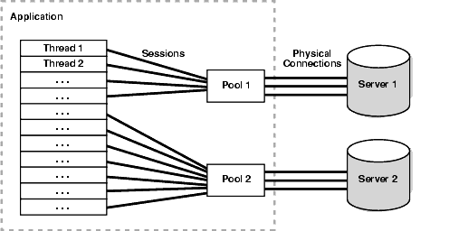
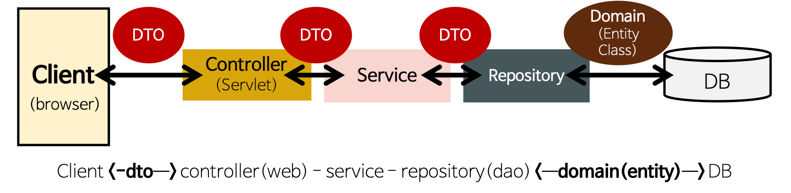

<<<<<<< HEAD
=======
### :smile: 순환 참조

#### :book: 순환 참조란?
* Bean A도 Bean B를 참조하고, Bean B도 Bean A를 참조하는 경우에 발생
* Bean B가 생성되지 않았는데 Bean A가 Bean B를 참조해 버리면 문제 발생
* 따라서 순환 참조가 발생하면 스프링은 Bean A, B 둘중 어느 것을 먼저 생성해야 하는지 결정하지 못하고, 결국 오류를 발생시킨다.

#### :book: 순환 참조 해결 방법
* @Lazy 어노테이션 사용
  ```java
  @Component
  public class A {
      private final B b;

      @Autowired
      public A(@Lazy B b) {
          this.b = b;
      }
  }
  ```
  ```java
  @Component
  public class B {
      private final A a;

      @Autowired
      public B(A a) {
          this.a = a;
      }
  }
  ```
  * @Lazy 방식은 Bean A의 초기화 시점에 Proxy Bean B를 주입하여 초기화를 미루고, 실제로 Bean A가 사용될 때 Bean B를 주입하는 방식이다.
  * 스프링에서 권장하지 않는 방식이다.

* Setter 주입, Field 주입
  * 순환 참조를 회피할 수 있다. 그러나 요즘에는 생성자 주입을 권장하므로, 잘 안쓰이는 방법이다.
  * 생성자 주입은 순환 참조가 일어났을 경우 에러를 발생시키면서 Spring이 구동되지 않기 때문에 순환 참조에 대한 예방이 가능하다.

* 순환 참조 에러 해결 방법이 여러개 있지만, 순환 참조가 안 일어나도록 설계하는 것이 좋은 디자인이다.
# DAO (Data Access Object)

> 실제로 DB에 접근하는 객체

- DB의 Data를 CRUD하는 계층 (Persistence Layer)
    - Persistence Layer : Database에 Data를 CRUD 하는 계층
- Service와 DB를 연결하는 고리 역할 < Service - DAO - DB >

DAO를 사용하는 이유는 `효율적인 커넥션 관리`와 `보안성` 때문

- 저수준 데이터 로직과 비즈니스 로직의 분리 (보안)
- DAO는 데이터를 조회하거나 조작하는 기능을 전담하도록 만든 객체!! (비용 절감)
    - 컨트롤러나 서비스는 필요할 때 이미 연결된 DAO를 통해 메서드를 호출해서 DB 접근
    - 잦은 DB 접근의 높은 오버헤드 비용

        웹 애플리케이션은 HTTP 요청에 따라 Thread를 생성하게 되고 대부분의 비지니스 로직은 DB 서버로 부터 데이터를 얻게 된다. 만약 위와 같이 모든 요청에 대해 DB접속을 위한 Driver를 로드하고 Connection 객체를 생성하여 연결한다면 물리적으로 DB 서버에 지속적으로 접근해야 한다.

        이러한 상황에서 DB Connection 객체를 생성하는 부분에 대한 비용과 대기 시간을 줄이고, 네트워크 연결에 대한 부담을 줄일수 있는 방법이 있는데 바로, DBCP(Database Connection Pool)를 이용하면 이러한 문제를 해결할 수가 있다.

        - DBCP를 이용한 효율 극대화
            1. WAS가 실행되면서 미리 일정량의 DB Connection 객체를 생성하고 `Pool` 이라는 공간에 저장해 둔다.
            2. HTTP 요청에 따라 필요할 때 Pool에서 Connection 객체를 가져다 쓰고 반환한다.
            3. 이와 같은 방식으로 HTTP 요청 마다 DB Driver를 로드하고 물리적인 연결에 의한 Connection 객체를 생성하는 비용이 줄어들게 된다.

                

사용자는 Interface를 DAO에 제시하고 이 Interface를 구현한 구현체는 사용자에게 자원을 편리하게 사용할 수 있도록 반환한다. (인터페이스로 구현하면 확장성과 유연성이 좋아진다.)

→ 다수의 DB 접근 DAO가 담당해 오버헤드를 줄일 수 있다.

# DTO

> 각 계층 간 데이터 교환을 위한 객체 (데이터를 주고 받는 포맷)

어떤 데이터를 DB → 서비스 → 컨트롤러 → 사용자 로 보내거나
반대로 사용자 → 컨트롤러 → 서비스 → DB로 데이터를 전송할 때 사용하는 객체를 말한다. (계층 간

- DTO는 따로 로직을 가지고 있지않으며 필드값에 접근하기위한 getter, setter만을 가지는 클래스이다.
    

- 데이터베이스에 새로운 데이터를 넣거나 수정할 경우 또는 특정 값을 조회해야할 경우
우리는 원하는 데이터를 지정해야하고 그러려면 값을 받아와야 한다.
    - 어떤 작업을 하기 위해 필요한 필수 요구 사항을 DTO라고 하면 될것 같다.
- 클라이언트가 컨트롤러에 요청했을 때 `요청할 양식`, `돌려 받을 양식`을 정의해주는 것 ⇒ ***DTO***

# Entity Class

> 실제 DB의 테이블과 매칭될 클래스

- 최대한 외부에서 getter로 클래스 내 값을 접근하지 않도록 필요한 로직을 메서드로 구현
- 메서드를 구현하되, Domain Logic만 가지고 있어야하며 Presentation Logic을 가져서 안됨
- `@Entity`, `@Column`, `@Id` 등의 어노테이션 이용

### Entity 클래스와 DTO 클래스를 분리하는 이유

- View Layer와 DB Layer의 역할을 분리하기위해서
- 테이블과 매핑되는 Entity클래스는 변경 시 여러 클래스에 영향을 준다.
DTO 클래스는 자주 변경될 수 있으므로 두 개를 분리 시킨다.

## 전체 구조


>>>>>>> 53fc0349a5e90359949b4608c1874a76873340d3
