# README.md

## Web Service

네트워크 사에서 서로 다른 종류의 컴퓨터들 간에 상호작용하기 위한 소프트웨어 시스템

## Web Application

remote server와 연결되어 있고 웹 브라우저를 통해 인터넷 접속

- 웹 어플리케이션을 실행하는 서버 → 웹어플리케이션 서버
- 클라이언트의 요청이 계산이나 데이터베이스가 필요한 요청의 경우 **웹서버**에서 **웹어플리케이션**으로 넘긴다.

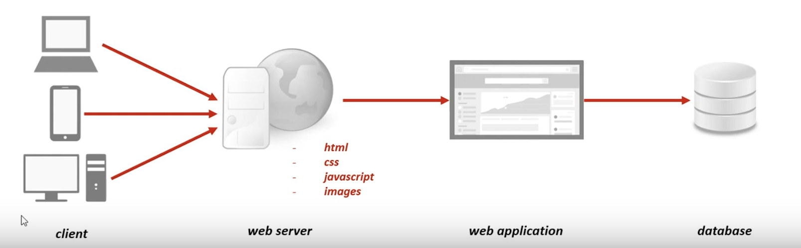

- webmail, retail sales, 은행, 경매 등

## SOAP (Simple Object Access Protocol)

- xml request, response
- http, https, smpi 등을 통해 XML 기반의 메시지를 네트워크 상에서 전달
- Header와 Body로 이뤄져있음
- 무겁고 느리며 주 데이터에 비해 **메타데이터가 너무 많음**

## REST (REpresentational State Transfer)

> REST는 HTTP Method를 통해 resource를 처리하도록 설계된 아키텍처

- Resource의 **Representation(표현//대표,이름)에 의한 `상태 전달`**
    - 컴퓨터 자원의 **상태** → 데이터, 파일 등
    - DB의 학생 정보 ⇒ `student` (자원의 표현)
    - 데이터가 요청된 시점에 자원의 상태 전달 (JSON or XML)
- `HTTP Method`를 통해 Resource 를 처리 (기존 웹 기술과 **HTTP 프로토콜 이용을 통한 장점**)

HTTP URI(Uniform Resource Identifier)를 통해 자원(Resource)을 명시하고, HTTP Method(POST, GET, PUT, DELETE)를 통해 해당 자원에 대한 CRUD Operation을 적용하는 것을 의미

안드로이드, 아이폰 같은 모바일 디바이스에도 쉽게 통신이 가능하다.

## RESTful

- REST API를 제공하는 웹 서비스
    - 이해하기 쉽고 사용하기 쉬운 REST API 만들기 (**Restful한** API를 구현하도록 노력) [몇가지 기준 맞춤]

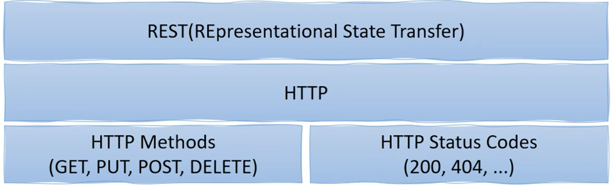

- HTTP protocol 사용하기 위해서 사용하는 어플리케이션
    - 인터넷 웹브라우저, POST, MAP, CURL
- 제공 자원
    - URI : 인터넷 자원을 나타내는 유일한 주소
    - 응답 시 XML, HTML, JSON 사용

정리하자면 REST는 예쁜 URI에 XML이 아닌 JSON을 내려준다고 해서 REST라고는 할 수 없다. 대신에 다음 전략을 따르며 기존 고객을 빠져나가지 않게 하는 것을 돕는 것이다.

1. 이전 필드를 삭제하지 말고 지원해라.

2. rel-based한 링크를 사용하여 client가 URI를 하드코드하지 않게 한다.

3. old 링크들을 가능한 한 오래 보유해라. URI가 바뀐다고 하더라도 기존 rels를 보유하여 기존 고객들이 새로운 기능으로 연결되게 하라.

4. 클라이언트에게 다양한 상황에서 행동들을 알려주기 위해 데이터를 단순 적재 하지말고 Link를 사용해라.

---

---

# Spring Boot

> 스프링 프레임워크 기반 프로젝트를 복잡한 설정없이 쉽고 빠르게 만들어주는 라이브러리

- 스프링 프레임워크를 사용할 때 최소한의 설정만 하도록 도와줌
- 단독 실행가능한 스프링 어플리케이션(Embed Tomcat, jetty, Undertow)
- 복잡하고 단순 반복인 설정 작업들을 쉽게해줌
- 개발자는 비지니스 로직에 더 집중할 수 있음

1. SpringBootApplication
2. Auto Configuration - 필요한 설정 작업 실행
3. Component Scan - 프로젝트에 선언된 각종 컴포넌트를 읽어 **인스턴스를 메모리 형태로 스프링 빈에 등록**

## REST API

한 명의 사람은 여려개의 포스팅이 가능하다.

User → Posts (1 대 다 관계)

- 한 개의 Rest API만으로도 HTTP Method를 통해 구분하기 때문에 여러 개의 서비스를 구현할 수 있다. (장점)

## Spring project실행

- Embedded tomcat도 같이 실행

## pom.xml & application.properties

- 전체 프로젝트에 필요한 설정 지정 (pom)
- 스프링 부트 실행에 필요한 설정 지정 (spring boot)
- `starter` 로 지정한 설정과 디펜던시 정보가 pom.xml에 들어가 있음

## 스프링부트는 일반 컨트롤러가 아닌 rest 컨트롤러 class로 작동

- `@RestController` annotation 사용
- RequestMapping(method) → Getmapping 변화

## lombok

- `lombok` 의 `@Data` 어노테이션으로 추가함으로써 해당 클래스의 <**세터 게터 생성자 등>이** 모두 자동으로 생성된다고 한다.
- `lombok` 의 `@AllargsConstructor` 어노테이션을 통해 생성자 자동 생성
- `@NoArgsConstructor` : 디폴트 생성자를 위한 annotation

더 이상 생성자 세터 게터를 따로 만들 필요가 없다.

→ intlliJ 설정 : preference의 'annotation'을 검색해 annotation processing을 활성화 시켜줘야한다.

→ 왼쪽 구석에 structure를 확인해보면 생성되있는 메서드를 확인할 수 있다.

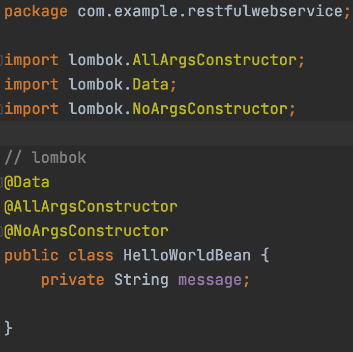

lombok을 이용해 간단하게 HelloWorldBean이라는 **자바** **빈**을 만들 수 있다.

## 생성된 클래스의 반환 값

- `string` 형태의 반환 값
    - `Hello World`
- `자바 빈` 형태를 `JSON`으로 변환한 반환 값
    - `{"message":"Hello World"}`

# 스프링 부트의 작동원리

## application.yml or .preperties

- 설정을 지정하는 역할
- 직관적인 설정
- .properties → 설정이름 = 값
- .yml → 설정이름 : 값

### logging level 설정하기 (in .yml file)

```yaml
logging:
  level:
      org.springframework : DEBUG
```

→ `org.springframework` 부분만 `DEBUG`로 `log`로 출력하겠다.

## DispatcherServlet

- 클라이언트의 `모든 요청`을 받아서 처리
- 요청에 맞는 Handler로 `요청 전달`
- Handler의 실행 결과를 `Http Response` 형태로 반환

    🚄 실행순서

    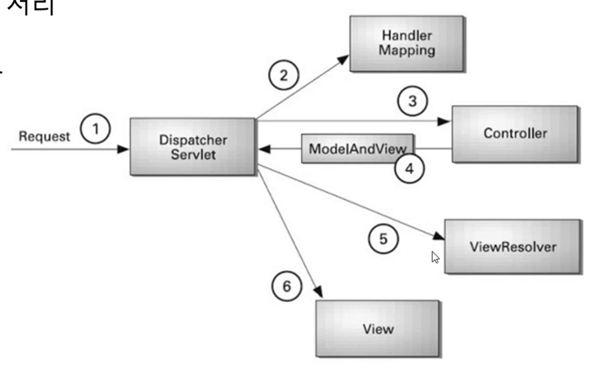

    1. 클라이언트 요청 받아 들임
    2. 핸들러 전달 또는
    3. 컨트롤러로 전달
    4. 모델 형태로 반환
    5. 사용자에게 보여주려는 형태로 ViewResolver가 페이지 생성
    6. 페이지 값에 모델을 포함시켜 반환

- **DispatcherServletAutoConfiguration 메소드**
    - 사용자 요청을 처리해주는 게이트 (DispatcherServelet)
    - 그것을 자동으로 설정해주는 메소드
- **HttpMessageConvertersAutoConfiguration 메소드**
    - 사용자에게 결과값을 반환해주기 위해 사용되는 메소드

## RestController

- Spring의 그냥 `@Controller` 특징
    - <Controller - View> : 주로 View를 반환하기 위해 사용
    Dispatcher Servlet → Handler Mapping → Controller → View
    - <Controller - Data> : Data를 반환하며 `@ResponseBody` 어노테이션 필요
- `Spring4`부터 xml 등에 직접 입력하지 않고 각종 컨테이너를
`@RestController` 와 같은 어노테이션을 사용해서 등록
- 개발하려는 Rest API 서비스는 사용자에게 보여주기 위한 format이 아니므로
**view를 갖지 않는** `REST Data`(JSON/XML)을 반환
- 사용자에게 보여지는 페이지를 가지지 않는 컨트롤러
——> `RestController`
- `@Controller` + `@ResponseBody`

## Path Variable 사용

가변 path 사용

```java
@GetMapping(path = "/hello-world-bean/path-variable/{name}") //가변 path
    public HelloWorldBean helloWorldBean(@PathVariable String name) {
        return new HelloWorldBean(String.format("Hello World, %s", name));
    }
```

`{name}` 은 가변 값이 들어갈 수 있다.

URI의 name위치에 yunhwan이 들어온다면 String name의 값으로 yunhwan이 들어오게 된다.

이 후 JSON형태로 클라이언트에 값을 반환한다.

---

---

# 📁 User Domain 생성

- 도메인이란?
    - 특정 전문분야에서 사용되는 업무 지식을 뜻한다.

[도메인이란?의 사본](https://www.notion.so/52159930d1984c85a505e4983172751f)

- User 도메인 생성
    - lombok을 이용하기 때문에 변수값만 정의

# 서비스 생성

- **UserDaoService** 에선 **비즈니스 로직** 추가 (서비스 클래스) + 간단한 DAO 역할
    - findAll(), save(), findOne()
    - 스프링프레임워크에 `@Service` 어노테이션을 통해 서비스 사용을 알림
    - 작은 유저 데이터 추가

- 사용자 컨트롤러 추가
    - `@RestController` 사용 (Json 형태의 객체 데이터를 반환)
    - 서비스 클래스 인스턴스 사용

        ```java
        @RestController
        public class UserController {
            //private UserDaoService service = new UserDaoService();
            private UserDaoService service;

            // 의존성 주입을 통해 빈에 등록된 인스턴스를 사용
            // 생성자를 통한 주입
            public UserController(UserDaoService service) {
                this.service = service;
            }
        ```

    - 의존성 주입을 하는 이유
        - 문제점 : A클래스가 생성되기 위해 B클래스가 필요하다면 A는 B에 의존성을 가진다. 이는 B클래스 수정시 A의 수정도 불가피해지게 되며 결합도가 높아진다.
        - 이유 ⇒ 의존성, 결합도를 줄이거나 없엘수 있다.
        의존성 수정이 필요한 경우 생성자 주입 등을 통해 **코드를 쉽게 수정할 수 있다. (유지보수)**

# 컨트롤러 생성

# 📁 GET

- GET Method
    - `@GetMapping(/<path>)`
    - 전체 멤버와 특정 멤버 `조회`

    ```java
    @GetMapping("/users/{id}")
        public User retrieveUser(@PathVariable int id) {
            return service.findOne(id);
        }
    ```

# 📁 POST

- POST Method
    - 같은 URI여도 전송 방식에 따라 전혀 다른 수행을 한다.
    - 사용자 추가 ***API***
    - `@RequestBody` 전달받을 필드 값

```java
		@PostMapping("/users")
    public void createUser(@RequestBody User user) {
        User savedUser = service.save(user);
				// 인자로 받은 유저를 리스트에 추가하는 서비스 메서드
    }
```

# 📁 Status Code 제어

- 200 : 서버의 성공 응답 코드
- 201 반환 코드
(예외 핸들링을 적절히 사용해서 반환코드를 작성하자)
- servletUriComponentBuild를 통해 응답 헤더에 값 넣기

    ```java
    @PostMapping("/users")
    public ResponseEntity<User> createUser(@RequestBody User user) {
        User savedUser = service.save(user); // 인자로 받은 유저를 리스트에 추가하는 서비스 메서드

        URI location = ServletUriComponentsBuilder.fromCurrentRequest()
                .path("/{id}")
                .buildAndExpand(savedUser.getId())
                .toUri();
        return ResponseEntity.created(location).build();
    }
    ```

# 📁 Exception Handling

- ***`10012`***는 존재하지 않지만 서버 실행에는 이상이 없기에 200 OK 가 반환된다.

    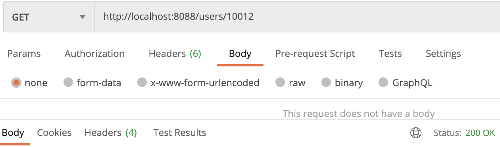

- 예외 코드 발생 시키기
    - `DIR: (user/UserController)`

    ```java
    @GetMapping("/users/{id}")
        public User retrieveUser(@PathVariable int id) {
            User user = service.findOne(id); // command + option + v 사용

            if (user == null) { // 유저가 존재하지 않다면... 오류처리
                throw new UserNotFoundException(String.format("ID[%s] not found", id));
            }
            return user;
            // return service.findOne(id) => Data가 없으면 NULL을 반환할 뿐 오류 코드를 반환하지는 않는다.
        }
    ```

    - `DIR: (user/UserNotFoundException)`
        - `@ResponseStatus(HttpStatus.NOT_FOUND)` → 404 에러코드 반환

    ```java
    public class UserNotFoundException extends RuntimeException { // 실행시 발생하는 오류 RuntimeException
        public UserNotFoundException(String message) {
            // 부모 클래스로 전달 받은 메서드를 반환 (부모 -> RuntimeException)
            super(message);
        }
    }
    ```

    - `500 서버 에러 메시지`와 `사용자 메시지` 반환됨

    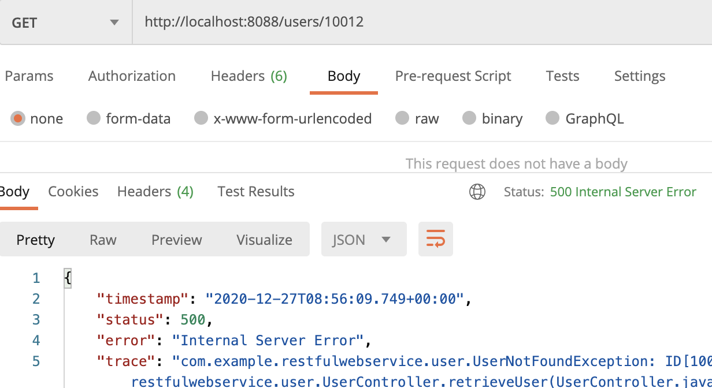

### HTTP Status code

- `2XX` → OK (요청 정상 처리)
- `4XX` → Client (클라이언트 잘못, 권한, 잘못된 접근)
- `5XX` → Server (서버의 오류, 프로그램상 오류, 외부 리소스 오류)

### HttpStatus.NOT_FOUND 상태코드 반환

- `annotation` 사용하기

```java
@ResponseStatus(HttpStatus.NOT_FOUND)
public class UserNotFoundException extends RuntimeException { // 실행시 발생하는 오류 RuntimeException
    public UserNotFoundException(String message) {
        // 부모 클래스로 전달 받은 메서드를 반환 (부모 -> RuntimeException)
        super(message);
    }
}
```

## 🗞️ 특정 예외 처리가 아닌 *일반적 예외 처리*

- 컨트롤러 빈에서 예외 발생 시 공통적인 예외처리 (Use. AOP)
- 스프링프레임워크 공통(로깅, 로그인, 공통 메시지) ⇒ AOP 사용

`@ControllerAdivce`
→ 모든 컨트롤러가 실행될 때 반드시 이 어노테이션을 가지고 있는 빈이 실행된다.

`@ExceptionHandler` 란??

- 일반화 Exception 처리
    - `@ExceptionHandler(Exception.class)`
- ***특정 Exception 처리***
    - `@ExceptionHandler(Exception클래스이름.class)`

### 일반화 Exception 코드 작성

- ExceptionResponse Class 작성

```java
@Data
@AllArgsConstructor
@NoArgsConstructor
public class ExceptionResponse {
    private Date timestamp;
    private String message;
    private String details;
}
```

- CustomizedResponseEntityExceptionHandler 작성

```java
@RestController
@ControllerAdvice
public class CustomizedResponseEntityExceptionHandler extends ResponseEntityExceptionHandler {
    @ExceptionHandler(Exception.class)
    public final ResponseEntity<Object> handleAllExceptions(Exception ex, WebRequest request) {
        ExceptionResponse exceptionResponse =
                new ExceptionResponse(new Date(), ex.getMessage(), request.getDescription(false));

        return new ResponseEntity(exceptionResponse, HttpStatus.INTERNAL_SERVER_ERROR);
    }
}
```

예외처리 클래스를 생성해서 *날짜시각, 예외메시지, 설명*을  ResponseEntity로 보낸다.

- 전송된 예외 메시지 결과
    - 일반화 Exception 코드에 설정한 필드

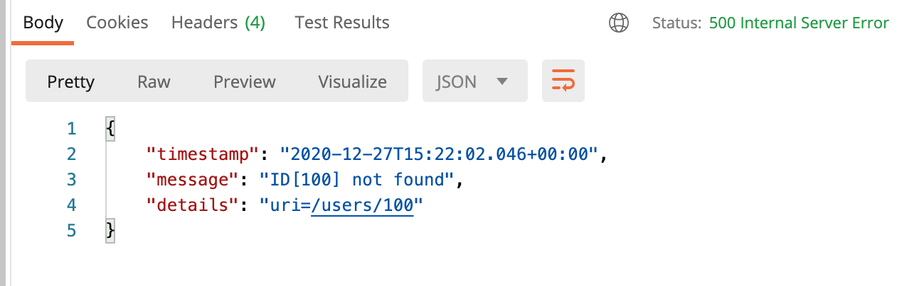

### 특정 예외 처리 결과

- 어노테이션의 클래스를 특정예외처리 클래스로 지정해준다.
    - 처리해줄 **메시지**와 **상태코드**를 결정한 후 반환한다.

        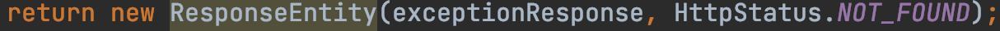

        

# 📁 DELETE

- Delete Method란
    - 삭제 HTTP Method

- User 정보를 삭제하는 코드
    - 도메인 `서비스` 를 먼저 구현한다.

    ```java
    public User deleteUserById(int id) {
            Iterator<User> iterator = users.iterator();

            while (iterator.hasNext()) {
                User user = iterator.next();

                if (user.getId() == id) {
                    iterator.remove();
                    return user;
                }
            }
            return null;
        }
    ```

    전체 리스트에 찾는 ID가 있으면 `유저` 를 반환

    없다면 `null` 을 반환

    - 컨트롤러 Delete Method 구현
        - DeleteMapping 어노테이션 사용 (지울 id 지정)

    ```java
    @DeleteMapping("/users/{id}")
        public void deleteUser(@PathVariable int id) {
            User user = service.deleteUserById(id);

            if (user == null) {
                throw new UserNotFoundException(String.format("ID[%s] not found", id));
            }
        }
    ```

PUT 또한 rest API 중 하나

- **sql 쿼리와의 비교**
(GET→select,
 POST→insert,
 PUT→update,
 DELETE→delete)

---

intelliJ Tip

- 패키지 이동
    - 맨 위의 패키지 명을 수정한 후 option + Enter로 패키지 옮김
- uri url 차이
- 크롬 개발자 도구 Status 확인

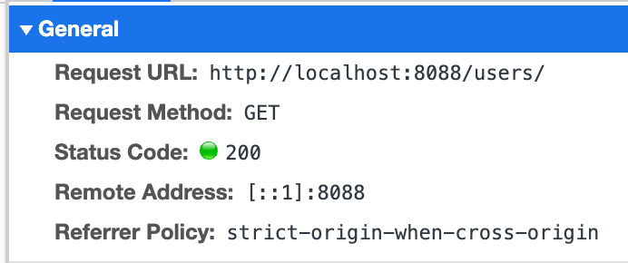

---

---

# Validation (유효성 검사)

JDK API, Hibernate Validation

### User 코드

- `@Size(min=?)`
    - 필드의 값에 최소 길이 정보 Check
- `@Past`
    - 회원이 가입하는 날짜는 미래 데이터가 될 수 없다. (Check)

### User Controller 코드

- creatUser를 사용할 때 `User`객체가 JSON 타입으로 넘어옴
- 이 때 `@Valid` 어노테이션이 있다면 Validation Check를 진행함 ***
    - `@size(min=2)` 이므로 **400 Bad Request**가 반환됨
    - **400 Bad Request : 사용자의 잘못된 요청**

    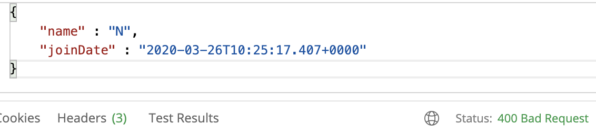

- Customized...ExceptionHandler 코드
    - Exception부모의 handleMethodArgumentNotValid 오버라이드 해서 사용 (예외를 커스터마이징해서 사용하는 방법)

    ```java
    @Override
        protected ResponseEntity<Object> handleMethodArgumentNotValid(MethodArgumentNotValidException ex, HttpHeaders headers, HttpStatus status, WebRequest request) {
            ExceptionResponse exceptionResponse = new ExceptionResponse(new Date(), "Validation Failed", ex.getBindingResult().toString() );
            return new ResponseEntity<>(exceptionResponse, HttpStatus.BAD_REQUEST);
        }
    ```

    이런 식으로 NotValid한 메서드 인자를 따로 처리해줄 수 있다. 해당 메서드는 부모 클래스에서 가져온 메서드를 오버라이드 하여 사용하였다.

    - 반환한 JSON 형태의 Body

    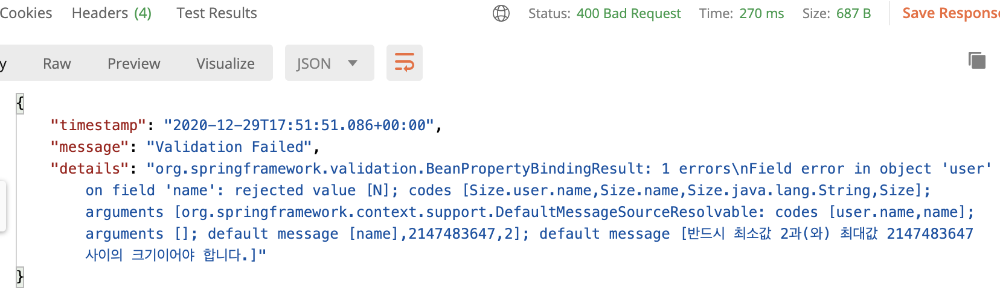

    ```java
    @Size(min=2, message = "Name은 2글자 이상 입력해 주세요")
    ```

    - Validation 오류 발생 시 message

# Internationalization

> 하나의 출력값을 여러가지 언어로 표현해주는 것

다국어처리를 스프링 빈에 미리 등록해둔다.

```java
@SpringBootApplication
public class RestfulWebServiceApplication {

    public static void main(String[] args) {
        SpringApplication.run(RestfulWebServiceApplication.class, args);
    }

		//Bean에 등록
    @Bean
    public LocaleResolver localeResolver() {
        SessionLocaleResolver localeResolver = new SessionLocaleResolver();
        localeResolver.setDefaultLocale(Locale.KOREA);
        return localeResolver;
    }
}
```

- 다음은 application.yml 설정하기
- 다국어 파일 설정하기 (messages_xx.properties)

어노테이션을 통해 스프링 부트가 초기화 될 때 이 정보들이 메모리에 로드되서 다른쪽에 있는 클래스에서 이를 사용할 수 있게된다.

- 다국어 컨트롤러 등록하기

```java
@GetMapping(path = "/hello-world-internationalized")
    public String helloWorldInternationalized(@RequestHeader(name="Accept-Language", required=false) Locale locale) {
        return messageSource.getMessage("greeting.message",null, locale);
    }
```

헤더 정보의 Accept-Language 값을 보고 어떤 파일의 메시지를 반환해줄 지 결정한다. (디폴트는 한국어)

- 헤더의 KEY로 Accept-Language
Value로는 fr을 설정하면 설정된 fr파일로 접근에 해당 메시지를 반환한다.

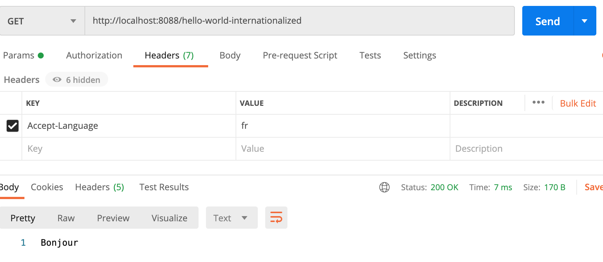

## XML format

json → xml 사용해보기 (헤더의 값 첨가를 통해 특정 형태 요청)

- 의존성 추가 전
- **Header = {Accept : application/xml}로 GET (xml 요청)**
    - 실패 (아직 서버에서 xml로 반환해줄수가 없음)

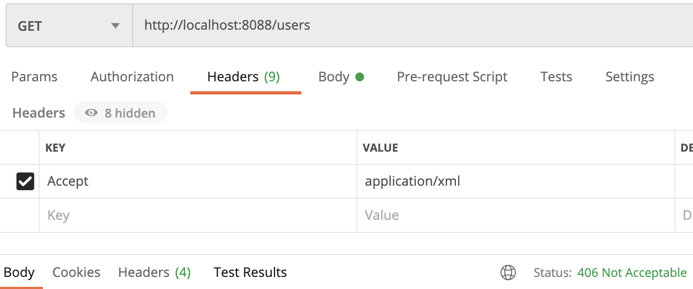

- **xml처리를 위한 jackson 의존성 추가**

    ```xml
    <dependency>
    	<groupId>com.fasterxml.jackson.dataformat</groupId>
    	<artifactId>jackson-dataformat-xml</artifactId>
    	<version>2.10.2</version>
    </dependency>
    ```

- 의존성 추가 후 xml 형태로 받을 수 있음

    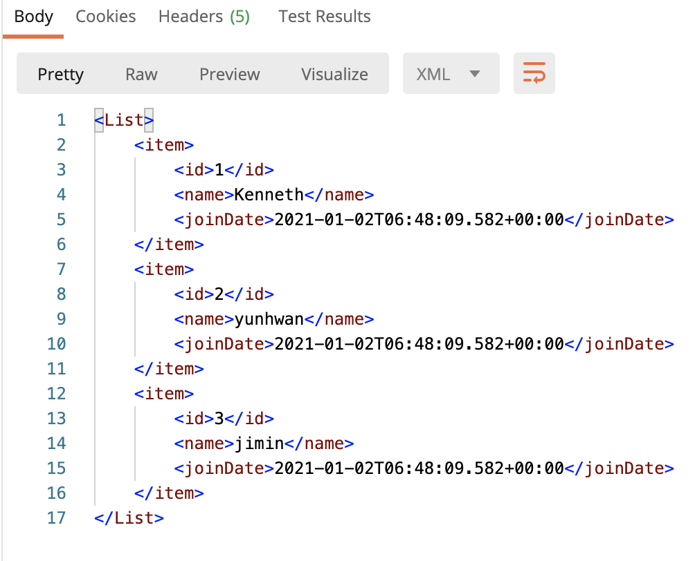

## Filtering

> Password 또는 개인정보를 filtering하는 방법

- User 도메인에 passoword 주민번호 추가

```java
@Data
@AllArgsConstructor
public class User {
    private Integer id;

    @Size(min=2, message = "Name은 2글자 이상 입력해 주세요")
    private String name;
    @Past
    private Date joinDate;

    private String password;
    private String ssn;
}
```

- User의 변수 추가로 lombok 자동 생성자 변경됨
⇒ 생성자 사용 수정 필요 (UserDaoService)

    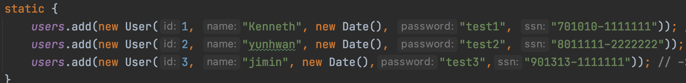

나머지 부분은 User를 가지고 사용하기 때문에 수정하지 않아도 된다.

- GET /users 반환값 (문제점 : 개인정보를 보호하지 않고 반환)

    ```java
    [
        {
            "id": 1,
            "name": "Kenneth",
            "joinDate": "2021-01-02T06:58:49.732+00:00",
            "password": "test1",
            "ssn": "701010-1111111"
        },
        .....
    ]
    ```

- xml 반환을 위해 추가한 ***jackson 라이브러리***를 통해 **데이터 유출 제어**

### 1. 어노테이션 사용하기

- `@JsonIgnore` : 데이터 값을 무시! ***(아예 반환 안됨)***

**OR**

- User클래스 위에 `@JsonIgnoreProperties(value={"변수명", "변수명"})`

### 2. 프로그래밍으로 제어하기

- 먼저 User 클래스 위에 `@JsonFilter("사용자지정이름")`

### 그 다음 관리자 컨트롤러 생성

**일반 유저가 볼 수 없는 데이터를 접근할 수 있도록 함**. UserController를 조금 수정하면 됨

- SimpleBeanPropertyFilter 사용! → 만든 필터를 지정 도메인에 적용! (FilterProvider)

- `@RequestMapping("/주소")` : 클래스의 공통된 URI를 지정
- 필터링을 통한 데이터 반환 (MappingJacksonValue)
⇒ **반환할 데이터 필드를 필터링해서 넘겨줄 수 있음!!!**

    ```java
    @GetMapping("/users")
        public MappingJacksonValue retrieveAllUsers() {

            List<User> all = service.findAll(); //cmd + option + v를 통해 리턴과 리턴값을 분리할 수 있따.

            SimpleBeanPropertyFilter filter = SimpleBeanPropertyFilter
                    .filterOutAllExcept("id", "name", "joinDate", "password");

            // 첫 번째 인자가 UserInfo 빈(도메인)을 대상으로 사용될 필터임을 알려줌)
            FilterProvider filters = new SimpleFilterProvider().addFilter("UserInfo", filter);
            MappingJacksonValue mapping = new MappingJacksonValue(all);
            mapping.setFilters(filters);

            return mapping; // 전체 사용자 값 즉 (User를 가지고 있는 List 반
        }
    ```

# Version 관리

## URI를 이용한 REST API 버전 관리

URI에 API 버전을 명시할 수 있도록 만들자..

- admin/Users ⇒ admin/v1/Users (버전명을 추가)
    - `URI`를 통해 `API 버전별`로 메서드를 사용할 수 있음
    1. 버전 1 ⇒ 기본 유저의 정보
    2. 버전 2 ⇒ 기본 유저 + grade 정보

```java
@GetMapping("/v2/users/{id}")
    public MappingJacksonValue retrieveUserV2(@PathVariable int id) {
        User user = service.findOne(id); // command + option + v 사용

        if (user == null) { // 유저가 존재하지 않다면... 오류처리
            throw new UserNotFoundException(String.format("ID[%s] not found", id));
        }

        UserV2 userV2 = new UserV2();
        BeanUtils.copyProperties(user, userV2); //user데이터를 userV2로 복사 user의 데이터를 모두 가짐
        userV2.setGrade("VIP"); // 사용자의 등급도 관리하는 V2

        SimpleBeanPropertyFilter filter = SimpleBeanPropertyFilter
                .filterOutAllExcept("id", "name", "joinDate", "grade");

        // 첫 번째 인자가 UserInfo 빈을 대상으로 사용될 필터임을 알려줌)
        FilterProvider filters = new SimpleFilterProvider().addFilter("UserInfoV2", filter);
        MappingJacksonValue mapping = new MappingJacksonValue(userV2);
        mapping.setFilters(filters);
        return mapping;
        // return service.findOne(id) => Data가 없으면 NULL을 반환할 뿐 오류 코드를 반환하지는 않는다.
    }
```

Filter를 이용해 보여줄 필드 값을 결정한다.

## Request Parameter & Header를 이용한 API Version 관리

- Request Parameter를 이용한 API 버전 관리 (URI para)
    - 어노테이션만 수정하면 된다.
    - [`http://localhost:8088/admin/users/1/?version=1`](http://localhost:8088/admin/users/1/?version=1) (예시)

```java
    @GetMapping("/v1/users/{id}")
=> 어노테이션 수정을 통해 URI에서 인자 값으로 버전을 넘겨줄 수 있다.
    @GetMapping(value = "/users/{id}/", params = "version=1")
```

- Header를 이용한 API 관리
    - `@GetMapping(value = "/users/{id}", params = "X-API-VERSION=1")`
    - 헤더에 버전 정보를 실어서 보냄

    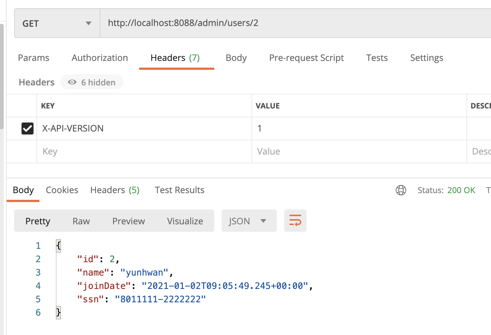

- mine-type??을 이용

    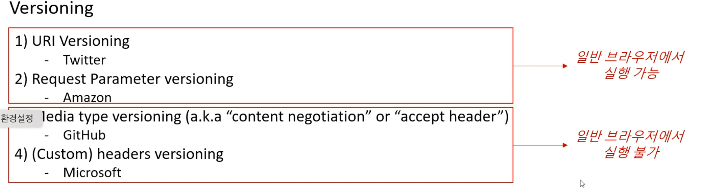

⇒ API Documentation을 만들어 사용자에게 기본적인 사용 방법을 제공해야함
